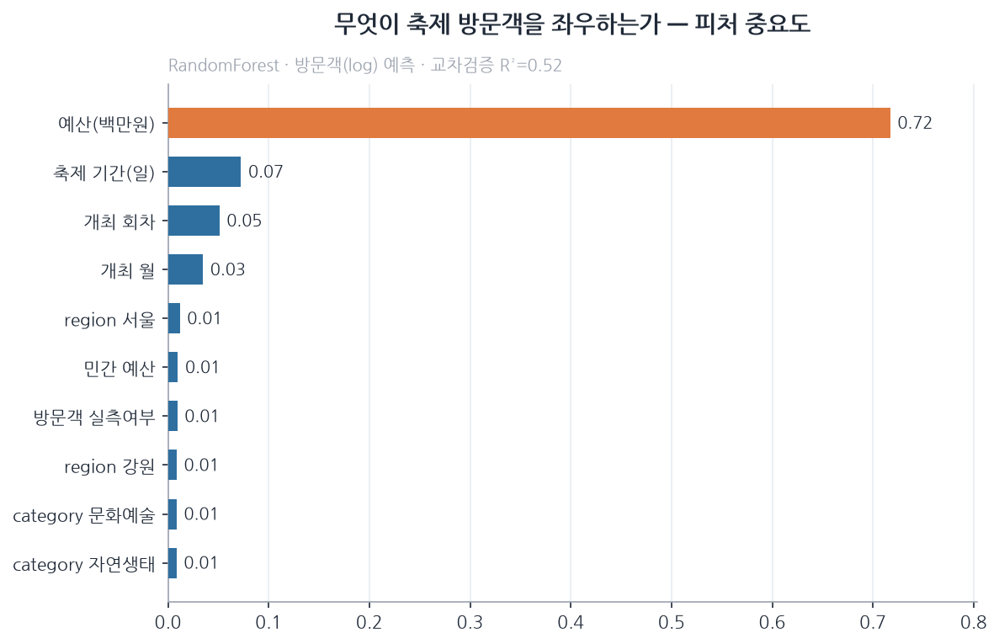
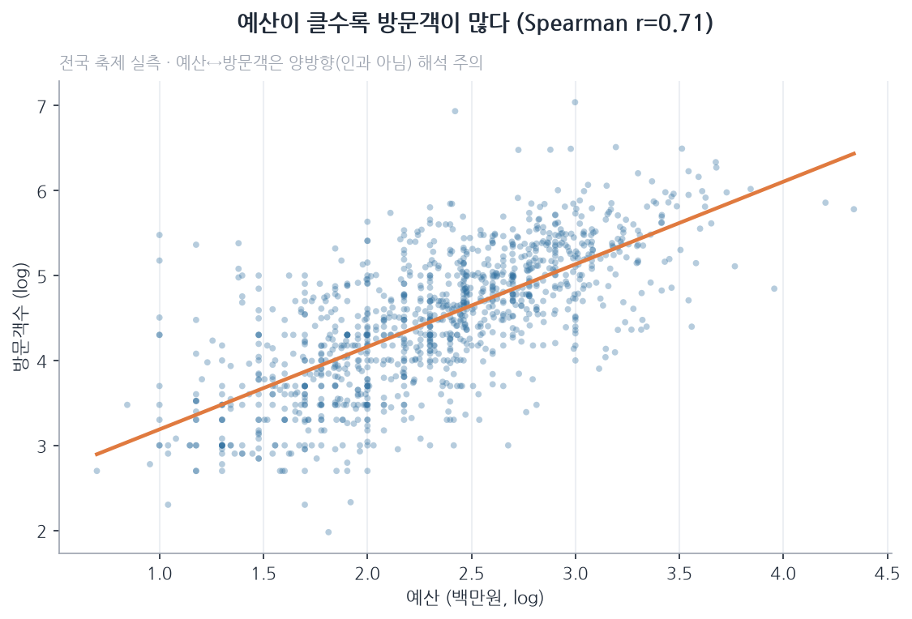
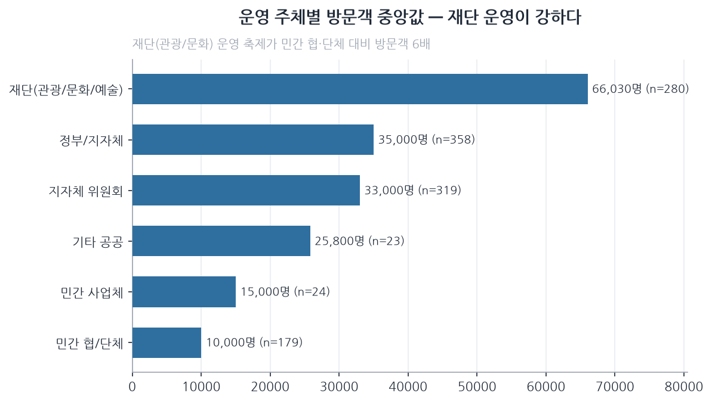

# EDA 결과 — 무엇이 축제 방문객을 좌우하는가

> 데이터를 더 수집하기 **전에**, 지금 가진 변수들이 방문객 예측(y=방문객수)에
> 어떻게·얼마나 영향을 주는지 먼저 파악한다.
> 분석 코드: `src/eda.py` · 차트: `src/eda_charts.py` → `docs/figures/`

**데이터**: 문체부 2026 전국축제 방문객 실측 1,183건 · **분석**: Spearman 상관 +
그룹별 중앙값 + RandomForest 피처 중요도(교차검증)

---

## 핵심 결론

| 순위 | 변수 | 영향 | 근거 |
|------|------|------|------|
| 1 | **예산** | 압도적 | Spearman r=0.71 · 중요도 0.72 |
| 2 | **축제 기간(일수)** | 강함 | r=0.53 |
| 3 | **개최 회차(연륜)** | 중간 | r=0.22 |
| 4 | **운영 주체** | 강함(범주) | 재단 6.6만 vs 민간협·단체 1.0만 (6배) |
| 5 | **지역** | 강함(범주) | 대전 3.3배·서울 2.4배 vs 지방 |
| 6 | **축제 유형** | 중간(범주) | 전통역사 1.5배 vs 주민화합 0.5배 |

**구조 변수만으로 방문객 변동의 52%(R²=0.52)를 설명.**
→ 나머지 48%는 아직 **미수집 변수**(날씨·주변인구·K콘텐츠·홍보·경쟁) 몫.
→ 이 변수들을 붙이면 예측력이 오른다 = **추가 데이터 수집의 근거**.

---

## 변수별 상세

### 수치형 (log 방문객과 Spearman 상관)
- **예산 r=0.71** — 단일 최강. 단, 예산↔방문객은 **양방향**(큰 축제라 예산 크고,
  예산 커서 방문 큼) → 인과로 단정 금지, 규모의 대리지표로 사용.
- **기간 r=0.53** — 길수록 누적 방문↑. 기획에서 조절 가능한 레버.
- **회차 r=0.22** — 오래된 축제일수록↑ (평판·인지도 축적).
- 국비·민간예산·실측여부·정부지원은 약한 양(+) 관계.

### 범주형 (방문객 중앙값, 전체 33,500명 대비)
- **운영주체**: 재단(관광/문화) 66,030명 ≫ 민간 협·단체 10,000명 → **운영 역량이 결정적**
- **지역**: 대전·서울·충북·광주·울산이 상위 (도시·접근성)
- **유형**: 전통역사 > 자연생태 > 지역특산물 > 문화예술 > 주민화합
- **주기**: 매년 개최 34,625명 ≫ 격년·일회성 1만명 → 지속성이 중요

---

## 이 결과가 모델·수집에 주는 시사점

1. **모델 필수 피처(확정)**: 예산·기간·회차·운영주체·지역·유형 — 이미 확보.
2. **다음 수집 우선순위**(설명 안 되는 48%를 잡을 후보):
   - 날씨(평년·예보) — 실외 축제 방문 변동
   - 주변 인구/접근성 — 수요 베이스라인
   - K콘텐츠 인기도 — 외국인 방문(별도 검증됨)
   - 홍보 투입/사전예매 — 선행지표
   - 경쟁(같은 주말 인근 축제)
3. **데이터 품질**: 방문객 실측(measured)은 453건뿐 → 학습 시 실측 우선·추정 가중 낮춤.
4. **누수 주의**: 예산은 강력하지만 인과 아님. 홍보·트렌드는 반드시 **시점 정합**으로.

> 결론: 지금 변수로도 절반은 설명된다. 나머지 절반을 위해 **어떤 데이터를 더
> 모아야 하는지**가 이 EDA로 분명해졌다.
